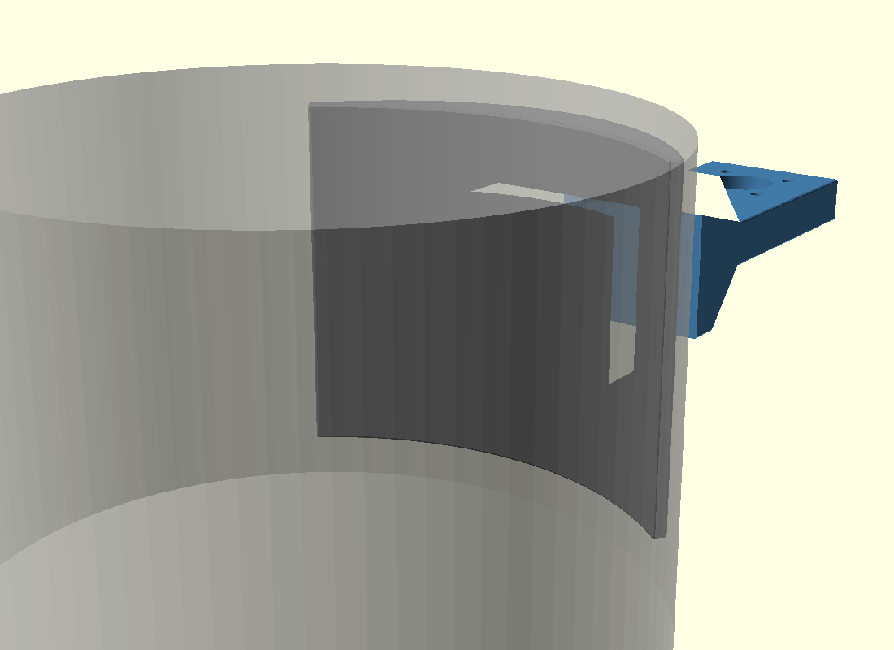

# Support universel pour poteau Ø145 mm

Système modulaire en 2 pièces imprimées 3D pour fixer un accessoire quelconque sur un poteau de **Ø145 mm** (circonférence 45.5 cm), serré par 2 colliers serflex inox.



La pièce qui se fixe au poteau (**Part A**) est universelle pour ce diamètre. La pièce qui porte l'accessoire (**Part B**) est interchangeable — la variante livrée ici porte un connecteur SO-239 pour antenne radioamateur, mais d'autres variantes sont possibles (BNC, dipôle, lampe, panneau, plate vierge…).

## Architecture

| Pièce | Fichier STL | Rôle |
|---|---|---|
| **Part A** — base poteau | `stl/pole_base.stl` | Arc tapered épousant le poteau Ø145, gorges pour les 2 colliers serflex, plateforme de fixation 38×38 mm avec 4 inserts M5. **Indépendant de l'accessoire.** |
| **Part B** — mount accessoire | `stl/mount_so239.stl` | Pièce qui porte l'accessoire. **Variante actuelle** : SO-239 chassis 4 trous (entraxe 19 mm). |

Les deux pièces se boulonnent l'une à l'autre via une interface 38×38 mm avec 4 vis M5 sur entraxe carré 24 mm.

## Variantes possibles de Part B

Tant que la plate arrière respecte l'interface (38×38, 4 trous M5 sur entraxe carré 24, lamage Ø9.5×4 sur face avant), n'importe quelle Part B se monte sur la base Ø145. Quelques idées :

- **SO-239 / PL-259** — antenne whip radioamateur (présent : `mount_so239.scad`)
- **BNC / N-type** — autres connecteurs RF
- **Clamp pour dipôle horizontal**
- **Bride de boom Yagi**
- **Support de lampe / projecteur**
- **Plate pour panneau / signalétique**
- **Plate vierge** à percer soi-même
- **Crochet, étagère, porte-câbles, etc.**

## Configuration actuelle

- **Poteau** : Ø 145 mm (circonférence 45.5 cm)
- **Colliers** : 2× serflex inox Ø 141-165 mm, bande 12 mm (ex : Caianwin)
- **Variante Part B** : SO-239 chassis 4 trous, pour antenne whip avec PL-259 mâle

## Bill of Materials (BOM)

### Pièces imprimées

| Pièce | Volume | Masse PETG @40% infill | Bounding box |
|---|---:|---:|---|
| `pole_base.stl` | 83 cm³ | 47 g | 97 × 36 × 82 mm |
| `mount_so239.stl` | 45 cm³ | 26 g | 40 × 79 × 40 mm |
| **Total** | **128 cm³** | **73 g** | |

Matière conseillée : **ASA** (idéal extérieur) ou **PETG UV** (bon compromis). Éviter PLA et ABS pour usage extérieur.

### Quincaillerie (commune à toutes les Part B)

| Quantité | Référence | Usage |
|---:|---|---|
| 2 | Collier serflex inox Ø141-165 mm bande 12 mm | Serrage de Part A sur le poteau |
| 4 | Insert thermofusible laiton **M5 × L7 × OD7 mm** (ex : HANGLIFE) | Filetage M5 dans Part A |
| 4 | Vis CHC inox A2 ou A4 **M5 × 20 mm** | Liaison Part A ↔ Part B |

### Quincaillerie spécifique à la variante SO-239

| Quantité | Référence | Usage |
|---:|---|---|
| 4 | Vis CHC inox A2 **M3 × 10 mm** + écrou M3 | Fixation SO-239 sur Part B |
| 1 | Connecteur **SO-239 chassis 4 trous** (Ø 16 mm + entraxe 19 mm) | Interface antenne / coax |
| — | Câble coaxial avec PL-259 mâle | Liaison vers récepteur |

Pour environnement marin / côtier : remplacer les inox A2 (304) par **A4 (316)**.

## Assemblage

1. Imprimer Part A et Part B en PETG/ASA (4-5 périmètres, 40 % infill)
2. Insérer les 4 inserts laiton dans Part A au fer à souder (230-250 °C)
3. Monter l'accessoire sur Part B (ex : SO-239 + 4× M3)
4. Présenter Part A contre le poteau, faire passer les 2 colliers dans les gorges, les fermer autour du poteau et serrer
5. Boulonner Part B sur Part A avec 4 vis M5×20 (vis insérées **par l'avant**, têtes recessées dans les lamages Ø9.5)
6. Brancher l'accessoire (ex : antenne PL-259 mâle vissée sur SO-239, coax dessous)

## Adapter à un autre diamètre de poteau

Le fichier `bracket_for_hose_clamps.scad` est paramétré. Pour un autre diamètre, ouvrir le SCAD, modifier `pole_d` et régénérer :

```bash
openscad -o stl/pole_base.stl -D 'part="base"' bracket_for_hose_clamps.scad
```

Vérifier également :
- `bracket_arc_angle` (couverture angulaire, par défaut 80°)
- la plage des colliers (la circonférence totale du chemin de la bande doit rester ≤ 519 mm pour les serflex 141-165, sinon adapter le modèle de colliers)

**Bonne pratique** : si tu changes `pole_d`, créer un nouveau dossier projet (ex : `pole-mount-d80`) pour ne pas mélanger les STL.

## Créer un nouveau Part B

L'interface entre Part A et Part B est définie par ces constantes du SCAD :

```scad
iface_size          = 38;   // côté plate arrière (mm, avant chamfer)
iface_thick         = 8;    // épaisseur plate arrière
iface_bolt_pcd      = 24;   // entraxe carré des vis
iface_bolt_thru_d   = 5.5;  // diamètre trous traversants
iface_bolt_cbore_d  = 9.5;  // lamage têtes M5 (face avant)
iface_bolt_cbore_h  = 4;    // profondeur lamage
chamfer_r           = 0.8;  // rayon des chamfreints sur les arêtes externes
```

Toutes les arêtes externes sont automatiquement chamfreintes (rayon `chamfer_r`) via `minkowski()`, sauf les faces de jonction A↔B qui sont aplanies par clipping pour garder un contact propre.

Un nouveau Part B doit présenter :
1. Une plate arrière de **38 × 38 × 8 mm** à Y=0 (face contre Part A)
2. 4 trous traversants Ø 5.5 mm aux positions (±12, ±12) en X et Z
3. Lamages Ø 9.5 × 4 mm sur la **face avant** (Y = 8) — laisse 4 mm de lèvre de PETG sous la tête de vis
4. Si du matériau supplémentaire (gusset, bras, taper…) gêne l'insertion de la tête M5 (Ø9 mm), prolonger le lamage Ø 9.5 vers l'avant pour dégager le passage
5. La géométrie spécifique à l'accessoire à partir de Y=8 vers l'avant

## Marges de sécurité de la conception actuelle

- Wall vis ↔ bord plateforme : **3.8 mm** (spec HANGLIFE 2.6 min)
- Matière derrière insert : **12 mm** (spec HANGLIFE 8 min)
- Lèvre de PETG sous tête de vis dans Part B : **4 mm** (résiste ~3 kN, M5 serré main typique ~2 kN)
- Bras Part B (variante SO-239) : coefficient sécurité **2.9** (vent 100 km/h sur whip 1 m)
- Chemin total de la bande sur poteau + bracket : ~462 mm (colliers 141-165 → 443-519 mm)

## Fichiers du projet

```
projects/pole-mount-d145/
├── README.md                       (ce fichier)
├── bracket_for_hose_clamps.scad    (source paramétrique des 2 pièces)
├── stl/
│   ├── pole_base.stl               (Part A — base universelle Ø145)
│   └── mount_so239.stl             (Part B — variante SO-239 antenne)
├── v6_preview.png                  (rendu assemblé)
├── v6_exploded.png                 (rendu éclaté)
├── partB_front.png                 (vue de face Part B)
├── partB_side.png                  (vue de profil Part B)
└── partB_iso.png                   (vue 3/4 Part B avec taper)
```
