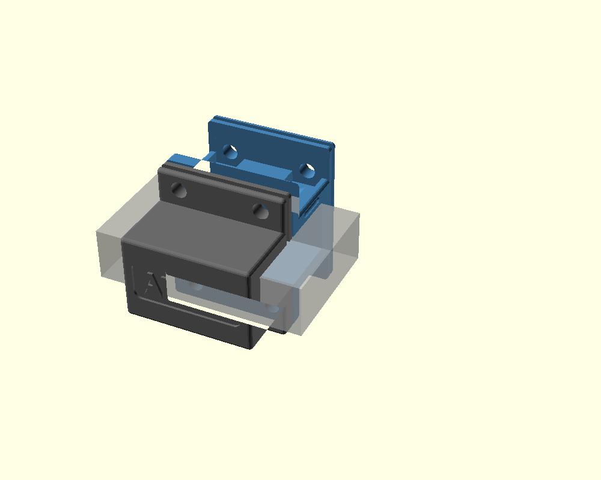
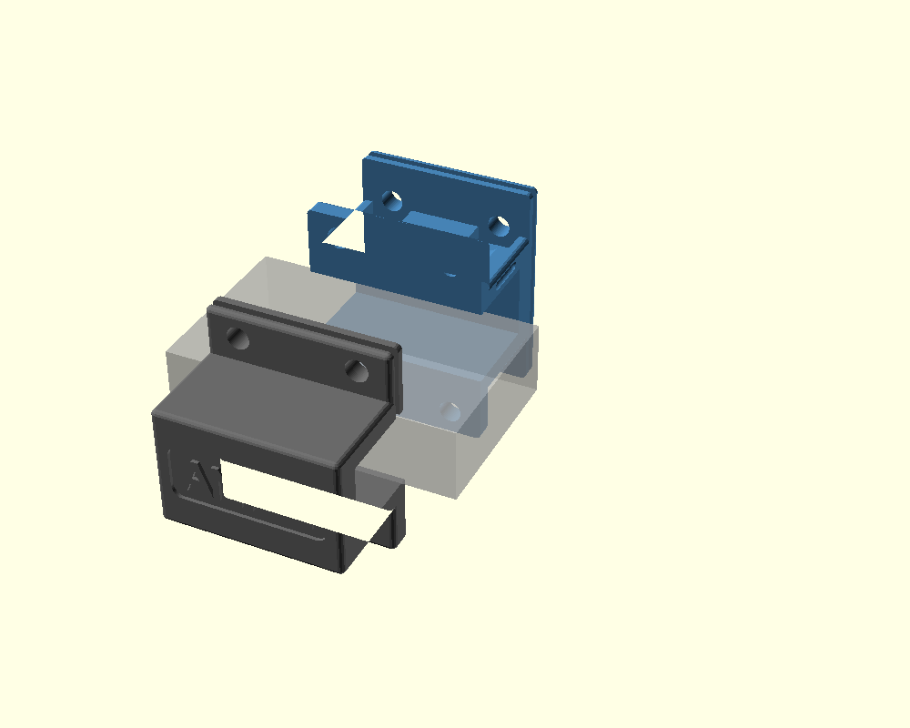
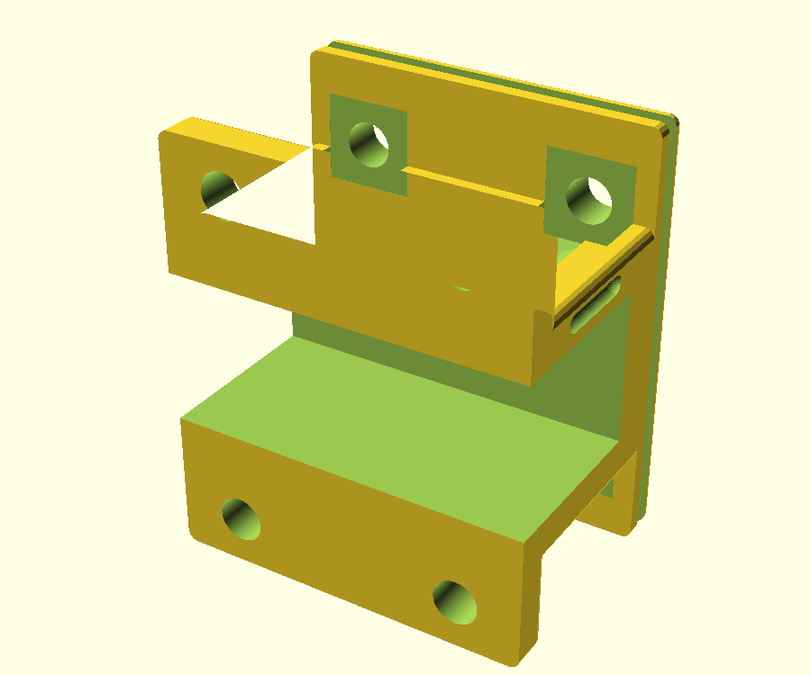

# Collier 2 parties pour rambarde rectangulaire 50 × 20 mm

Collier de serrage imprimé 3D en **2 demi-coquilles** qui enserrent une rambarde rectangulaire **50 mm (profondeur) × 20 mm (hauteur)** (cotes extérieures), avec une **platine de fixation en face avant** pour un accessoire et un **capot** de protection intempéries clipsable.



## Architecture

Séparation **avant / arrière** (plan vertical Y=0) : les **brides de serrage** et les 4 vis M6 sont **en haut et en bas**, ce qui laisse **toute la face avant libre** pour la platine (d'un seul tenant, sans joint). Le serrage referme le jeu de joint (`seam_gap`) et **pince** la rambarde.

| Pièce | STL | Rôle |
|---|---|---|
| **Demi-avant** | `stl/rail_clamp_front.stl` | Demi-coquille avant + **platine 50 × 59 mm** (4 trous M6, entraxe 32 × 36 mm) |
| **Demi-arrière** | `stl/rail_clamp_back.stl` | Demi-coquille arrière ; gravure **« ANFSI »** au dos |
| **Capot** | `stl/rail_clamp_capot.stl` | Coque de protection (toit + 2 flancs) ; gravures **« ANFSI »** + **« ADC PATTE »** sur le toit |

 

### Maintien du capot

On le pose **par le dessus**. Il tient par **tenon-mortaise en ∩** : une rainure 2 × 2 mm dans le **chant du haut** (centrée dans l'épaisseur), prolongée sur les 2 bouts → un **∩**, sur **2 prises** : la **platine** (avant) et la **bride arrière**. Les **languettes** du capot y descendent. Une **détente** (encoche arrondie sur les flancs gauche/droite + barbe sur le capot) le verrouille par un « clic ». Le capot s'arrête **au niveau de la rambarde** et **juste après la bride arrière** (il ne couvre pas le collier gris).

## Configuration

- **Rambarde** : 50 × 20 mm (ext.), jeu d'ajustement 0,5 mm/face (`fit_clear`, réglé pour le retrait de l'ASA).
- **Épaisseurs uniformes 6 mm** (parois, brides, platine).
- **Arêtes arrondies** (`round_r = 1,5`, minkowski) **sans surépaisseur** (cotes compensées) ; `round_r = 0` → arêtes vives.
- **Serrage** : 4 vis M6 (2 haut, 2 bas), trous traversants Ø 6,2 ; **écrous tenus à la clé**. Vis alignées en X avec les trous de platine (±16 mm).
- **Platine** : 50 (l) × 59 (h) × 6 mm, à fleur des brides ; 4 trous M6 (entraxe 32 × 36 mm, centré). Derrière chaque trou : **poche d'écrou 12 × 12 mm** + **canal profond** qui avale toute la longueur de la vis (M6 × 30 rentre sans buter).

## Bill of Materials

| Pièce | Bounding box | Volume | Masse PETG ~ |
|---|---|---:|---:|
| `rail_clamp_front.stl` | 50 × 37 × 59 mm | 45 cm³ | ~32 g |
| `rail_clamp_back.stl`  | 50 × 32 × 59 mm | 33 cm³ | ~23 g |
| `rail_clamp_capot.stl` | 56 × 44 × 22 mm | 10 cm³ | ~7 g |

Matière : **ASA** ou **PETG** (extérieur), éviter PLA. Environnement marin/côtier : visserie inox **A4 (316)**.

Visserie : **8 × vis M6** + **8 × écrous M6** (4 serrage + 4 platine), tous tenus à la clé.
- Serrage : M6 × 16–20 suffit (M6 × 30 marche, ~15 mm de filetage dépassent).
- Platine : longueur = épaisseur accessoire + ~10 mm (M6 × 30 → accessoire ≤ ~19 mm).

## Impression (ASA, usage extérieur)

L'ASA est le bon choix dehors, mais exigeant. **Important** : **caisson fermé** (sinon la pièce se déforme et fissure), **plateau ~100 °C**, buse ~250 °C, **ventilation faible** (10–30 %), **brim** (bordure d'accroche) + laque/colle ASA.

Orientation :
- **Demi-coquilles** : face de joint (la face plate du joint) **sur le plateau** → platine vers le haut, brides horizontales. **Activer les supports** : les bords de la platine dépassent du collier (ils ont besoin d'un appui ; les supports se retirent facilement, ils sont à l'extérieur).
- **Capot** : **toit sur le plateau**, ouverture vers le haut → aucun support.
- 4–5 périmètres, 40 % d'infill.

> **Faces de joint bien planes** : activer la compensation « pied d'éléphant » du trancheur (ou ébavurer la 1ʳᵉ couche), sinon les 2 demi-coquilles ne se ferment pas à plat.
> **Retrait ASA** : `fit_clear = 0,5` mm compense le rétrécissement pour que le collier glisse sur la rambarde ; trop serré → 0,6, trop lâche → 0,4.
> **Clic du capot** : il tient surtout par friction du ∩ ; ne force pas au remontage (l'ASA est cassant — le clip pourrait se fendre).

## Assemblage

1. Monter l'accessoire sur la platine (4 vis M6 par l'avant, écrous au dos dans les poches).
2. Présenter les 2 moitiés autour de la rambarde, placer les 4 écrous, engager les 4 vis et **serrer à la clé**.
3. **Capot** : le poser par le dessus → les languettes ∩ entrent dans les rainures (platine + bride arrière) et la détente **clipse**. Retrait par traction vers le haut.

## Paramétrer / régénérer

Fichier `rail_clamp.scad` entièrement paramétrique. Cotes clés en tête :

```scad
rail_w = 50; rail_h = 20;   // section rambarde (Y, Z)
fit_clear = 0.5;            // jeu par face (0,5 pour le retrait ASA)
clamp_len = 50;             // largeur (= longueur de prise)
seam_gap  = 1.2;            // jeu de joint (le serrage le referme)
```

Régénérer les STL :

```bash
openscad -o stl/rail_clamp_front.stl -D 'part="front"' rail_clamp.scad
openscad -o stl/rail_clamp_back.stl  -D 'part="back"'  rail_clamp.scad
openscad -o stl/rail_clamp_capot.stl -D 'part="capot"' rail_clamp.scad
```

Aperçu dans OpenSCAD : paramètre `part` = `preview`, `exploded`, `assembly`, `front`, `back`, `capot`, `assembly_capot`.

> **Serrage** : pince trop faible → augmenter `seam_gap` ou réduire `fit_clear` ; ne ferme pas → l'inverse.
> **Clic du capot** : trop dur → réduire `det_eng` ; trop lâche → l'augmenter.
> **Autre section de rambarde** : créer un nouveau dossier (ex. `rail-clamp-40x40`) plutôt que modifier celui-ci.

## Fichiers

```
projects/rail-clamp-20x50/
├── README.md
├── rail_clamp.scad      (source paramétrique des 3 pièces)
├── stl/                 (front, back, capot)
└── *.png                (preview, exploded, front, back, capot, capot_asm)
```
