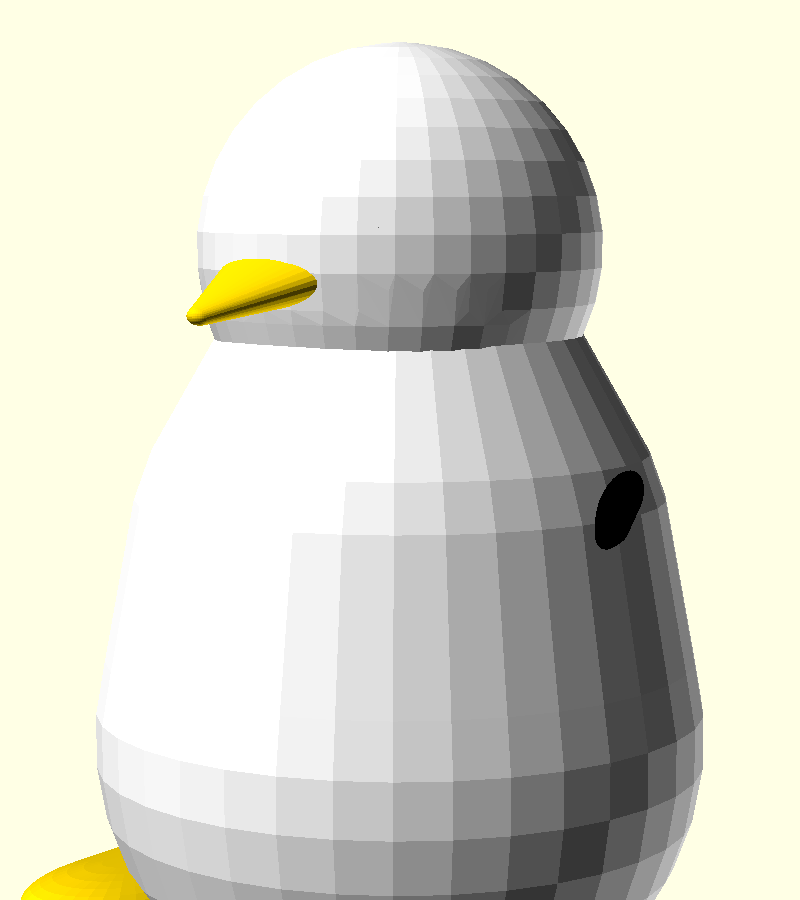
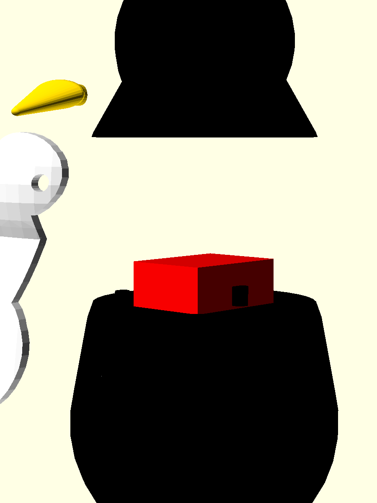

# Boîtier « Tux » pour M5Stamp S3

Boîtier décoratif en forme de **pingouin (Tux)** pour une carte **M5Stamp S3** (ESP32-S3). Multi-pièces et multicolore : coque noire, ventre/visage blanc, bec et pieds jaunes. La **tête (coque haute) se retire au niveau du col** pour installer la carte.

 

## Pièces

| Pièce | STL | Couleur | Rôle |
|---|---|---|---|
| Coque haute (tête + haut du corps) | `stl/tux_case_top.stl` | noir | se retire au col ; logement de la lèvre de centrage |
| Coque basse (bas du corps) | `stl/tux_case_bottom.stl` | noir | loge la carte ; ouverture USB ; **lèvre de centrage** au joint |
| Ventre + visage | `stl/tux_belly.stl` | blanc | insert (1,6 mm) qui se loge dans le renfoncement avant |
| Bec | `stl/tux_beak.stl` | jaune | emboîté par tenon (Ø 4) |
| Pied gauche / droit | `stl/tux_foot_left.stl`, `stl/tux_foot_right.stl` | jaune | emboîtés par tenon (Ø 4) |

## Carte et assemblage

- **M5Stamp S3** : 18,4 × 24,4 × 9,6 mm, prise **USB-C** (ouverture 10 × 4,2 mm), jeu `tol = 0,3 mm`.
- La carte se pose dans la **coque basse** ; la **coque haute** vient par-dessus, **centrée par une lèvre d'emboîtement** au plan de séparation (`split_z = 4`) : une fine nervure de paroi (`lip_t = 1,2 mm`, `lip_h = 3 mm`) qui dépasse de la coque basse et se loge dans la coque haute. Solidement rattachée (c'est la paroi prolongée).
- Le **ventre/visage** blanc se clipse dans le renfoncement avant ; **bec** et **pieds** s'emboîtent par tenons (collage possible).

> **Note** : les 6 pièces sortent chacune en **un seul corps étanche** (`comps=1`, manifold) — prêtes à imprimer. *(Version précédente : les coques avaient des pions d'alignement détachés ; remplacés par la lèvre de centrage.)*

## Impression

- Multicolore : imprimante **AMS/MMU**, ou imprimer chaque pièce séparément dans le bon filament (noir / blanc / jaune) puis assembler.
- Intérieur (PLA/PETG) suffit ; pas de contrainte mécanique.
- Les STL des coques sont exportés **prêts à poser** (`case_top` est déjà retourné).

## Régénérer les STL

```bash
for p in case_top case_bottom belly beak foot_left foot_right; do
  openscad -o stl/tux_$p.stl -D "part=\"$p\"" tux_m5stamp.scad
done
```

Aperçu dans OpenSCAD : paramètre `part` = `preview`, `exploded`, `case_top`, `case_bottom`, `belly`, `beak`, `foot_left`, `foot_right`.

## Fichiers

```
projects/tux-m5stamp/
├── README.md
├── tux_m5stamp.scad     (source paramétrique)
├── stl/                 (6 pièces)
└── v4d_*.png            (rendus : preview, exploded, front, face_zoom, belly_only)
```
